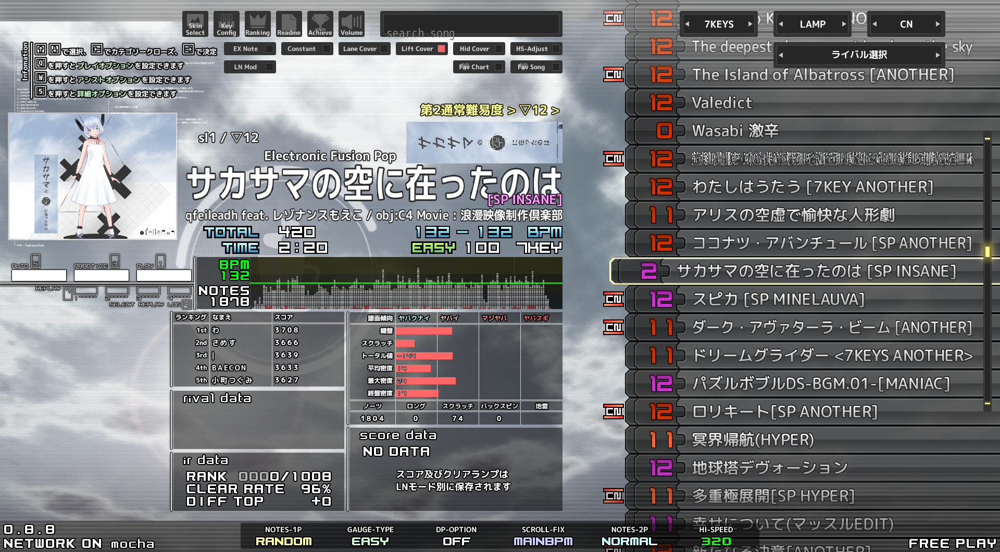

# m_select-diff-sabun

beatoraja の 選曲画面のスキン m-select で難易度表の難易度を表示できるようにするための差分情報です。

```
beatoraja
├── skin
│   └── m_select
│       ├── customize
│       │   └── advanced
│       │       └── test_subdiff
│       │           └── parts.lua
│       ├── enable.txt
│       └── subdiff.csv
├── table
│   └── *.bmt
└── scripts
    └── m_select-subdiff-sabun（このリポジトリ）
        └── create-subdiff-csv.py
```

- `test_subdiff/parts.lua` をコピーする
- 必要であれば `create-subdiff-csv.py` を走らせる
  - `../../table/*.bmt` の情報を使い `subdiff.csv` を生成する
- `subdiff.csv` をコピーする
- `m_select/enable.txt` に `test_subdiff/parts.lua` の行を追加する

上手くいくと画像のようになるはずです。



`m_select/customize/advanced/test_bmsanal/parts.lua` を元に作成しました。

